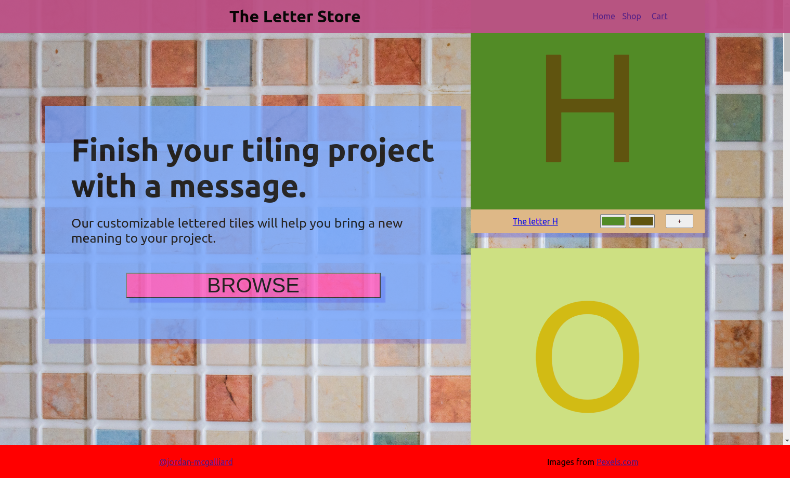
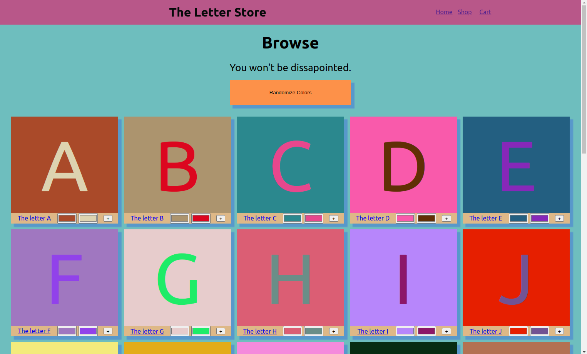
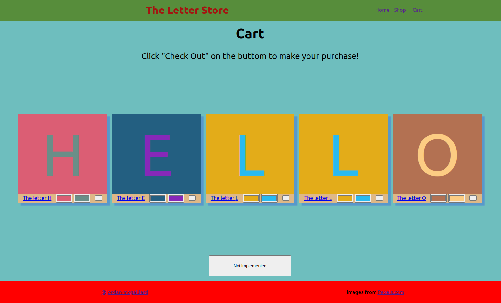
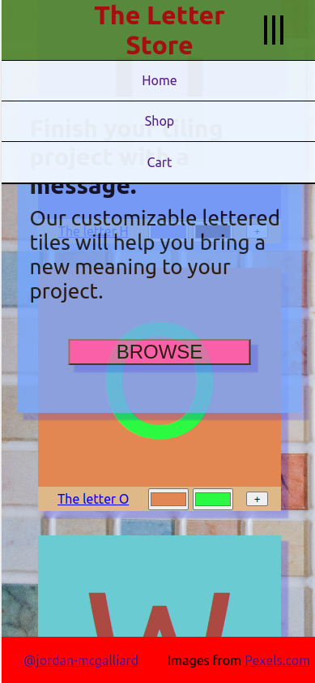
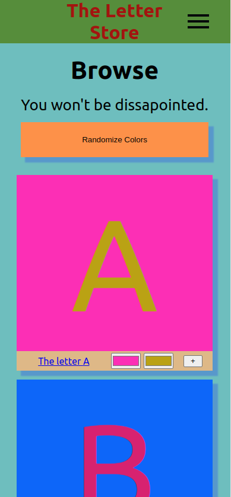

# The Letter Store 

A webpage where users can customize different tiles that they'd like to buy and add/remove them from their cart. Features a homepage, shop page, and cart page.

## Live Link

[Live link to the project] (https://jordan-mcgalliard.github.io/the-letter-store/)

## Why I made this project

- Improve React & CSS skills
- Make a responsive website that works well on desktop/mobile and scales well (within reason.)
- User React-Router in a real project
- Use CSS modules for the first time

## What I learned making this project

- The biggest thing is that as I developed the website, I realized new ways I could have used React components to accomplish what I wanted. However, it would involve going back and changing lots of code. So I was left with the choice of re-writing my code or having non-dry components. I think that better planning and experience will make this better. Example:
  -  Use a component as a wrapper for pages of certain types. For example, if you want your header to be static on 10 of 30 pages, you could have a component that wraps pages and adds padding to the top of those pages depending on the size of the header with JS, so the content starts after the header.
- I learned a lot about mobile design and some more advanced CSS topics:
  - Padding hacks to give elements the aspect ratio you want. Bonus: Do it to every element of a grid.
  - Using positioning, transforms, and transitions to implement my own toggle-able menu from scratch
  - Overflow, scrolling
  - More Grid practice
  - Media Queries
  - More details about how pagers are rendered. For example the address bar on mobile takes up space.
- CORRECTLY using keys when rendering a list of elements/components so that React doesn't get confused 
- I had much less problems with state than my last project, which I think means that I must have.. learned something?

## Pictures 

